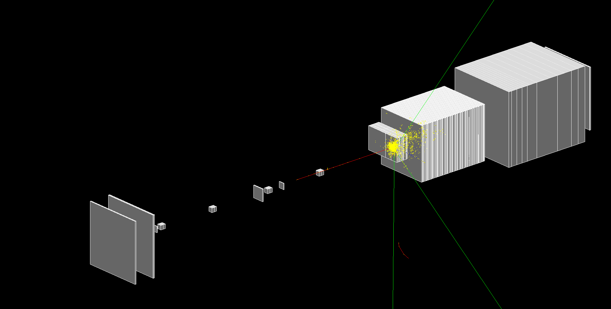

# CALICESiWTB
**A Geant4 simulation of the CALICE SiW calorimeter beam tests.**\
[](https://lopezzot.github.io/CALICESiWTB/)

<figure>

<figcaption align="center"><b>Fig. - 10 GeV charged pion passing through the CALICE SiW calorimeter.</b></figcaption>
</figure>

<br/><br/>

<!-- TABLE OF CONTENTS -->
<details open="open">
  <summary>Table of Contents</summary>
  <ol>
    <li><a href="#project-description">Project description</a></li>
    <li><a href="#authors-and-contacts">Authors and contacts</a></li>
    <li>
      <a href="#documentation-and-results">Documentation and results</a>
      <ul>
        <li><a href="#selected-presentations">Selected presentations</a></li>
      </ul>
    </li>
    <li>
      <a href="#geant-val-integration">Geant Val integration</a>
      <ul>
        <li><a href="#list-of-results-on-geant-val">List of results on Geant Val</a></li>
      </ul>
    </li> 
    <li><a href="#available-datasets-and-analyses">Available datasets and analyses</a></li>
    <li>
      <a href="#how-to">How to</a>
      <ul>
        <li><a href="#build-compile-and-execute-on-maclinux">Build, compile and execute on Mac/Linux</a></li>
        <li><a href="#build-compile-and-execute-on-lxplus">Build, compile and execute on lxplus</a></li>
        <li><a href="#submit-a-job-with-htcondor-on-lxplus">Submit a job with HTCondor on lxplus</a></li>
      </ul>
    </li>
    </li><li><a href="#my-quick-geant4-installation">My quick Geant4 installation</a></li>
    <li><a href="#selected-calice-siw-references">Selected CALICE SiW references</a>
  </ol>                                       
</details>

<!--Project desription-->
## Project description
The project targets a standalone Geant4 simulation of the CALICE SiW calorimeter beam tests to perform Geant4 regression testing, physics lists comparison and validation against test-beam data.
- ⏰ Start date: 17 February 2022 
- 📌 Status: under development
- ❕ DO NOTE: A first implementation was provided by Katalin Nikolics around 2018, the code is available in GitLab ( restricted link [](https://gitlab.cern.ch/ep-sft/calice-siw-ecal-tb/) ). This repo is an adaptation of it aiming to produce results with the same level of accuracy while reducing the code to a Geant4 advanced example.

<!--Authors and contacts-->
## Authors and contacts
- 👨‍🔬 Lorenzo Pezzotti (CERN EP-SFT) - lorenzo.pezzotti@cern.ch 
- 👨‍🔬 Supervisor: Alberto Ribon (CERN EP-SFT)
- 👩‍🔬 Katalin Nikolics (CERN EP-SFT)

<!--Documentation and results-->
## Documentation and results

### Selected presentations
- 🗣️ CERN EP-SFT Simulation Group Meeting 22/3/2022, **Validation on the CALICE SiW calorimeter beam test (first test, first results)** [](https://indico.cern.ch/event/1141927/contributions/4792467/attachments/2411878/4127542/G4_lopezzot_22_3_2022.pdf)

<!--Geant Val integration-->
## Geant Val integration
Geant Val [](https://geant-val.cern.ch/) is the Geant4 testing and validation suite. It is a project hosted on gitlab.cern.ch [](https://gitlab.cern.ch/GeantValidation) used to facilitate the maintenance and validation of Geant4 applications, referred to as <em> tests</em>.\
The following are instructions to use CALICESiWTB within Geant Val, from batch submission to website deployment.
1. On lxplus git clone ATLHECTB and the Geant Val/geant-config-generator
   ```sh
   git clone git@github.com:lopezzot/CALICESiWTB.git
   git clone ssh://git@gitlab.cern.ch:7999/GeantValidation/geant-config-generator.git
   ```
2. Copy the CALICESiWTB geant val scripts into tests/geant4/; cd geant-config-generator
   ```sh
   cp -r CALICESiWTB/geantval_scripts/CALICESiWTB/ geant-config-generator/tests/geant4/
   cd geant-config-generator
   ```
   Note that file inside ```tests/geant/CALICESiWTB/files/``` will be used by Geant Val for execution and data analysis.
3. We will execute CALICESiWTB via Geant Val using Geant4.10.7.p03, therefore we must make sure file ```10.7.p03.sh``` exists into ```configs/geant/```. In file ```10.7.p03.sh``` we also export the path to the CALICESiWTB 10.7.p03 executable file (for instruction on how to compile CALICESiWTB see [How to: Build, compile and execute on lxplus](#build-compile-and-execute-on-lxplus)).\
Hence ```10.7.p03.sh``` looks like this:
   ```sh
   #!/bin/bash

   VERSION="10.7.p03"
   PLATFORM="x86_64-centos7-gcc8-optdeb"

   # Geant4 libraries
   source /cvmfs/geant4.cern.ch/geant4/$VERSION/${PLATFORM}/bin/geant4.sh
   [ -e /cvmfs/geant4.cern.ch/geant4/$VERSION/setup_g4datasets.sh ] && source/cvmfs/geant4.cern.ch/geant4/$VERSION/setup_g4datasets.sh

   # Test path
   export PATH="/cvmfs/geant4.cern.ch/opt-geant-val/$VERSION/$PLATFORM/bin:/cvmfs/geant4.cern.ch/opt/$VERSION/$PLATFORM/bin:$PATH:/afs/cern.ch/work/l/lopezzot/Fellow/CALICE/geantval/build/"

   # Compiler
   source /cvmfs/sft.cern.ch/lcg/contrib/gcc/8/x86_64-centos7/setup.sh

   # Externals
   #export LD_LIBRARY_PATH="/cvmfs/sft.cern.ch/lcg/releases/LCG_88/ROOT/6.08.06/x86_64-centos7-gcc62-opt/lib:/cvmfs/sft.cern.ch/lcg/releases/LCG_88/qt5/5.6.0/x86_64-centos7-gcc62-opt/lib/:/cvmfs/sft.cern.ch/lcg/releases/LCG_88/hdf5/1.8.18/x86_64-centos7-gcc62-opt/lib/:$LD_LIBRARY_PATH"
   ```
4. Create macros and metadata for Geant Val execution
   ```sh
   python mc-config-generator.py submit -t CALICESiWTB -d OUTPUT -v 10.7.p03 -q "testmatch" -r
   ```
   this command creates the Geant Val files for batch submission using HTCondor under the ```OUTPUT``` folder, using CALICESiWTB, Geant4.10.7.p03 and the ```testmatch``` job flavour.
5. To monitor the jobs use
   ```sh
   python mc-config-generator.py status -t CALICESiWTB -d OUTPUT
   ```
   When the job execution ends, the root output files are stored in the corresponding job folder.
6. Execute the analysis on the root files in the ```OUTPUT``` folder to create Geant Val JSON output files
    ```sh
    python mc-config-generator.py parse -t CALICESiWTB -d OUTPUT 
    ```
    the analysis is coded in ```tests/geant4/CALICESiWTB/parser.py``` and in the root macros stored in each job folder. The ```OUTPUTJSON``` folder is created with the corresponding JSON files.
7. The last part is to deploy the results on Geant Val. The CALICESiWTB layout on the Geant Val website is defined in the ```CALICESiWTB.xml``` file on ```gitlab.com/thegriglat/geant-val-layouts``` (additional info are in the ```tags.json``` file).\
   Deploy JSON files on the Geant Val database
   ```sh
    find . -name '*.json' | while read i; do curl -H "Content-Type: application/json" -H "token: askauthor" --data @$i https://geant-val.cern.ch/upload; echo; done
   ```

### List of results on Geant Val
The following are results deployed on Geant Val so far. A copy of the used config files is stored in ```geantval_scripts/configs/```.

<!--Available datasets and analyses-->
## Available datasets and analyses
We provide datasets and ROOT analyses, as well as instructions for their reproducibility. Ask authors for access to datasets.

| CALICESiWTB      | Reproduce data | Reproduce analysis | Comments     |
| -------------    | ----------     | -----------        | -----------  |
| v0p4 <br /> Dataset #1 <br /> tag 0p4_1 | Geant4.10.07.p03 <br /> CALICESiWTB v0p4 <br /> ```./CALICESiWTB run_pi-_x_GeV.mac FTFP_BERT #nThreads``` <br /> x = 2, 4, 6, 8, 10 <br /> using FTFP_BERT physics list | ```root -l MyLongitudinalPlots.C```  | Analysis reproducable with analysis/v0.4/MyLongitudinalPlots.C macro <br /> assuming Data0p4_1/ is alongside root macro. <br /> New results on pion energy and hit longitudinal distributions. Prepared for the CALICE Collaboration Meeting April 2022. |
| v0p3 <br /> Dataset #1 <br /> tag 0p3_1 | Geant4.10.07.p03 <br /> CALICESiWTB v0p3 <br /> ```./CALICESiWTB run_pi-_x_GeV.mac``` <br /> x = 2, 4, 6, 8, 10 <br /> FTFP_BERT implicit physics list | ```root -l MyLongitudinalPlots.C```  | Analysis reproducable with analysis/v0.3/MyLongitudinalPlots.C macro <br /> assuming Data0p3_1/ is alongside root macro. <br /> First results on pion energy longitudinal distributions, shown at presentation on 22/03/2022. |

<!--How to:-->
## How to

### Build, compile and execute on Mac/Linux
1. git clone the repo
   ```sh
   git clone https://github.com/lopezzot/CALICESiWTB.git
   ```
2. source Geant4 env
   ```sh
   source /relative_path_to/geant4.10.07_p01-install/bin/geant4.sh
   ```
3. cmake build directory and make (using geant4.10.07_p01)
   ```sh
   mkdir CALICESiWTB-build; cd CALICESiWTB-build/
   cmake -DGeant4_DIR=/absolute_path_to/geant4.10.07_p01-install/lib/Geant4-10.7.1/ relative_path_to/CALICESiWTB/
   make
   ```
4. execute (example with ```run_pi-_2GeV.mac``` macro card, FTFP_BERT physics list and 2 threads)
   ```sh
   ./CALICESiWTB run_pi-_2GeV.mac FTFP_BERT 2
   ```
Parser options: argv[1] a Geant4 macro card, argv[2] the physics list (optional, default FTFP_BERT), argv[3] number of threads

### Build, compile and execute on lxplus
1. git clone the repo
   ```sh
   git clone https://github.com/lopezzot/CALICESiWTB.git
   ```
2. cmake build directory and make (using geant4.10.07_p03, check for gcc and cmake dependencies for other versions)
   ```sh
   mkdir CALICESiWTB-build; cd CALICESiWTB-build/
   source /cvmfs/sft.cern.ch/lcg/contrib/gcc/8.3.0/x86_64-centos7/setup.sh 
   source /cvmfs/geant4.cern.ch/geant4/10.7.p03/x86_64-centos7-gcc8-optdeb-MT/CMake-setup.sh 
   export CXX=`which g++`
   export CC=`which gcc`
   cmake3 -DGeant4_DIR= /cvmfs/geant4.cern.ch/geant4/10.7.p03/x86_64-centos7-gcc8-optdeb-MT/lib64/Geant4-10.7.3 ../CALICESiWTB/
   make
   ```
   Hint: cp and source the scripts/CALICESiWTB_lxplus_10.7.p03.sh file in the build directory.
3. execute (example 2 GeV pi- macro card, FTFP_BERT physics list and 2 threads)
   ```sh
   ./CALICESiWTB run_pi-_2GeV.mac FTFP_BERT 2
   ```

### Submit a job with HTCondor on lxplus
1. git clone the repo
   ```sh
   git clone https://github.com/lopezzot/CALICESiWTB.git
   ```
2. prepare execution files (example with Geant4.10.07_p03, 2 GeV pi- macro, 2 threads, FTFP_BERT physics list)
    ```sh
    mkdir CALICESiWTB-build; cd CALICESiWTB-build
    mkdir error log output
    cp ../CALICESiWTB/scripts/CALICESiWTB_lxplus_10.7.p03.sh .
    source CALICESiWTB_lxplus_10.7.p03.sh
    ```
3. prepare for HTCondor submission (example with Geant4.10.07_p03, 2 GeV pi- macro, 2 threads, FTFP_BERT physics list)
    ```sh
    cp ../CALICESiWTB/scripts/CALICESiWTB_HTCondor_10.7.p03.sh .
    export MYHOME=`pwd`
    echo cd $MYHOME >> CALICESiWTB_HTCondor_10.7.p03.sh
    echo $MYHOME/CALICESiWTB run_pi-_2GeV.mac FTFP_BERT 2 >> CALICESiWTB_HTCondor_10.7.p03.sh
    cp ../CALICESiWTB/scripts/CALICESiWTB_HTCondor.sub .
    sed -i '1 i executable = CALICESiWTB_HTCondor_10.7.p03.sh' CALICESiWTB_HTCondor.sub
    ```
4. submit a job
   ```sh
   condor_submit CALICESiWTB_HTCondor.sub 
   ```

<!--My quick Geant4 installation-->
## My quick Geant4 installation
Here is my standard Geant4 installation (example with Geant4.10.7.p01) starting from the unpacked geant4.10.07.tar.gz file under the example path "path/to".

1. create build directory alongside source files
      ```sh
   cd /path/to
   mkdir geant4.10.07-build
   cd geant4.10.07-build
   ```
2. link libraries with CMAKE (example with my favourite libraries)
   ```sh
   cmake -DCMAKE_INSTALL_PREFIX=/Users/lorenzo/myG4/geant4.10.07_p01-install \
   -DGEANT4_INSTALL_DATA=ON -DGEANT4_USE_QT=ON -DGEANT4_BUILD_MULTITHREADED=ON \
   -DGEANT4_USE_GDML=ON ../geant4.10.07.p01
   ```
3. make it
   ```sh
   make -jN
   make install
   ```

<!--Selected CALICE SiW references-->
## Selected CALICE SiW references
- 📄 <em>Testing hadronic interaction models using a highly granular silicon–tungsten calorimeter</em>, NIM A794 (2015): [](https://www.sciencedirect.com/science/article/pii/S0168900215006191?via%3Dihub)
